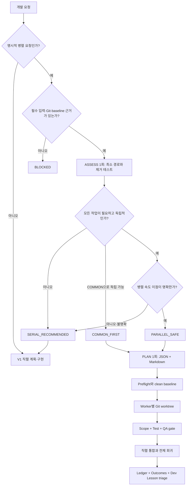

<div align="center">

# ⚡ Parallel Dev Plan Orchestrator


**필요한 작업만 병렬화하고, 애매한 작업은 빠르게 직렬로 전환하는 Codex 개발 오케스트레이션 스킬**

[](https://github.com/coreline-ai/dev-plan-v2/actions/workflows/test.yml)


[](https://github.com/coreline-ai/dev-plan-v2/commits/main)

[한글 요약](#-한글-요약) · [English](#-english-summary) · [빠른 시작](#-빠른-시작) · [판정 방식](#-병렬화-판정-방식) · [실행 파이프라인](#-실행-파이프라인) · [안전장치](#-안전장치) · [검증](#-개발-검증)

</div>

---

## 🇰🇷 한글 요약

`Parallel Dev Plan Orchestrator`는 **필요성·독립성·실제 속도 이점**을 한 번 평가해 직렬 구현, COMMON 선행 또는 안전한 병렬 실행을 선택하는 Codex 스킬입니다. 사용자 요청 수에 맞춰 작업을 억지로 나누지 않고, 완료 기준에 반드시 필요한 책임만 Workstream으로 사용합니다.

병렬 실행이 적합한 경우에는 격리된 Git worktree, 독점 write scope, 독립 테스트, 위험도 기반 QA, 재개 가능한 ledger를 적용합니다. 병렬 이점이 불명확하거나 조율 위험이 남으면 V2 산출물을 만들지 않고 즉시 직렬 경로로 전환하며, 실행 후 문제와 재발 방지 교훈은 Dev Lesson 흐름으로 보존합니다.

> [!IMPORTANT]
> **V1과 V2는 별도 설치입니다.** 일반 `개발 계획`·`구현 계획`은 V1 [`dev-plan-generator`](https://github.com/coreline-ai/dev-plan-skill)가 처리하고, 이 V2는 명시적인 `병렬 개발 계획`·`병렬화 가능한지 판단` 요청만 처리합니다. V2만 설치해도 V1이나 일반 개발 계획 기능이 자동으로 설치되지 않습니다.

## 🇺🇸 English Summary

`Parallel Dev Plan Orchestrator` is a Codex skill that evaluates **necessity, independence, and real delivery-time benefit** once, then selects serial implementation, a COMMON-first flow, or safe parallel execution. It never manufactures workstreams to match the number of user requests; only responsibilities required by the completion criteria can become lanes.

When parallel execution is justified, the skill uses isolated Git worktrees, exclusive write scopes, independent tests, risk-based QA, and resumable execution ledgers. If the benefit is unclear or coordination risk remains, it creates no V2 artifacts and immediately falls back to serial work. Post-QA failures and reusable prevention controls are preserved through the Dev Lesson workflow.

## 🏷️ Tags

[agent-skills](https://github.com/topics/agent-skills) · [ai](https://github.com/topics/ai) · [ai-agent](https://github.com/topics/ai-agent) · [ai-coding](https://github.com/topics/ai-coding) · [codex](https://github.com/topics/codex) · [coreline-ai](https://github.com/topics/coreline-ai) · [developer-tools](https://github.com/topics/developer-tools) · [developer-workflow](https://github.com/topics/developer-workflow) · [development-plan](https://github.com/topics/development-plan) · [git-worktree](https://github.com/topics/git-worktree) · [llm](https://github.com/topics/llm) · [multi-agent](https://github.com/topics/multi-agent) · [open-source](https://github.com/topics/open-source) · [orchestration](https://github.com/topics/orchestration) · [parallel-development](https://github.com/topics/parallel-development) · [python](https://github.com/topics/python) · [scope-control](https://github.com/topics/scope-control) · [workflow-automation](https://github.com/topics/workflow-automation)

## 📌 프로젝트 소개

`Parallel Dev Plan Orchestrator`는 명시적인 병렬 개발 요청을 분석하고, **자연스럽게 독립된 책임만** Git worktree에서 동시에 구현하도록 돕는 Codex 스킬입니다.

목표는 Workstream 수를 늘리는 것이 아니라 다음 전체 시간을 줄이는 것입니다.

```text
전체 완료 시간 = 계획 + 구현 + 조율 + 통합 + 재작업
```

병렬 이점이 명확하지 않으면 추가 질문이나 복잡한 점수 계산 없이 `SERIAL_RECOMMENDED`를 반환합니다. 이 경우 V2 plan, worktree, ledger를 만들지 않고 V1 `dev-plan-generator` 또는 일반 직렬 구현으로 즉시 전환합니다.

### 한눈에 보기

| 항목 | 동작 |
|---|---|
| 기본 경로 | 일반 개발 요청은 V1 직렬 계획 사용 |
| V2 진입 조건 | 사용자가 명시적으로 병렬 개발 계획을 요청 |
| 판단 기준 | `필요성 → 독립성 → 실제 속도 이점` |
| 직렬 전환 | 이점이 없거나 불명확하면 V2 산출물 없이 종료 |
| 병렬 실행 | 독립 write scope와 테스트가 있는 작업만 worktree 실행 |
| 계획 정본 | `parallel_*.json` |
| 실행 사실 | `parallel_*.execution.json` |
| 종료 교훈 | `parallel_*.outcomes.json`과 별도 Dev Lesson Markdown |

## ✨ 핵심 특징

### 1. 억지 분할 방지

- 사용자 요청 항목 수와 Workstream 수를 비교하지 않습니다.
- 하나의 사용자 결과도 여러 필수 책임으로 나뉠 수 있습니다.
- 여러 요청도 같은 API·schema·상태 모델에 결합되어 있으면 직렬입니다.
- 테스트·문서·QA는 관련 구현 Workstream의 완료 조건에 포함합니다.
- 병렬화를 위해서만 필요한 리팩터링·utility·추상화·중간 API는 별도 lane으로 만들지 않습니다.

### 2. 빠른 단일 ASSESS

- 별도 점수표나 정밀 시간 예측을 만들지 않습니다.
- Lead가 의미를 판단하고 Python 도구는 구조와 Git 근거만 검증합니다.
- `assessment_reasons`가 없으면 안전하다고 추정하지 않고 직렬로 전환합니다.
- COMMON 이후에도 `coordination_risks`가 남으면 직렬로 전환합니다.
- 같은 ASSESS를 반복하거나 질문 루프를 늘리지 않습니다.

### 3. 실행 안전성

- Worker별 exclusive write path를 강제합니다.
- tracked·staged·unstaged·untracked·delete·rename을 실제 Git diff로 검사합니다.
- COMMON 완료 commit을 모든 후속 lane의 동일 baseline으로 사용합니다.
- scope, test, QA 증거가 없는 lane은 통합하지 않습니다.
- plan hash와 Git commit이 불일치하면 `RESUME_BLOCKED`입니다.

### 4. 실패 교훈 재사용

- 계획 전에 관련 Dev Lesson을 검색합니다.
- Worker는 공유 Lesson 문서를 직접 수정하지 않습니다.
- 실행 중 문제는 occurrence 사실과 scope/test 증거만 Lead에게 반환합니다.
- Lead가 통합·QA 후 `plan-only | existing-reference | new-lesson`으로 분류합니다.
- 생성된 plan JSON/Markdown과 ledger는 Lesson 기록 때문에 수정하지 않습니다.

## 🧭 언제 사용하는가

| 상황 | 권장 결과 | 이유 |
|---|---|---|
| 일반 개발 계획 또는 작은 결합 작업 | V1 직렬 | V2 조율 비용이 더 큼 |
| 명시적 병렬 요청이지만 이점이 불명확 | `SERIAL_RECOMMENDED` | 재작업 위험을 피하고 즉시 구현 시작 |
| 공유 계약을 먼저 확정하면 작업이 독립 | `COMMON_FIRST` | 계약만 직렬로 고정한 뒤 제한적 병렬 실행 |
| 목표·write path·테스트가 각각 독립 | `PARALLEL_SAFE` | 실제 완료 시간을 줄일 가능성이 큼 |
| 필수 입력·Git·권한·baseline 근거 없음 | `BLOCKED` | 실행 가능한 근거부터 확인 필요 |

> [!IMPORTANT]
> 파일 경로가 다르다는 이유만으로 병렬 작업으로 판단하지 않습니다. 공유 계약, 선행 설계, 통합 시 재수정 가능성까지 함께 확인합니다.

## 🧠 병렬화 판정 방식

### Gate 1 — 필요성

먼저 사용자 완료 기준을 만족하는 **최소 직렬 구현 경로**를 짧게 확인합니다.

```text
이 Workstream을 제거해도 사용자 완료 기준을 만족하는가?
```

- `예` → 불필요하거나 병렬화를 위해 만든 작업이므로 제거
- `아니오` → 최소 구현에 필요한 작업 후보

### Gate 2 — 독립성

다음 중 하나라도 해당하면 직렬로 처리합니다.

- 다른 Workstream의 설계 결과를 기다려야 함
- 같은 API·schema·상태 모델을 동시에 결정함
- 별도로 구현하거나 테스트할 수 없음
- 통합 시 다른 lane을 다시 수정할 가능성이 높음
- 병렬화를 위해 추가 리팩터링이나 추상화가 필요함

원래 필요한 공유 계약 하나를 먼저 확정하면 독립되는 경우에만 `COMMON_FIRST`를 사용합니다.

### Gate 3 — 실제 속도 이점

```text
동시 실행으로 줄어드는 시간이
조율 + worktree + 검토 + 통합 + 재작업 비용보다 명확히 큰가?
```

- 명확히 큼 → `PARALLEL_SAFE` 또는 `COMMON_FIRST`
- 작거나 불명확 → `SERIAL_RECOMMENDED`

## 🔄 실행 파이프라인



## 🚀 빠른 시작

### 요구 환경

- Git과 `git worktree`
- Python `3.11` 또는 `3.12`
- Codex skill runtime
- 일반 개발 계획·직렬 fallback·Dev Lesson 연동을 위한 별도 V1 `dev-plan-generator`

### 0. V1을 먼저 별도 설치

```bash
git clone https://github.com/coreline-ai/dev-plan-skill.git
SKILLS_ROOT="${CODEX_HOME:-$HOME/.codex}/skills"
mkdir -p "$SKILLS_ROOT"
cp -R dev-plan-skill/dev-plan-generator "$SKILLS_ROOT/dev-plan-generator"
```

V1 없이도 V2는 명시적 병렬 요청의 ASSESS를 수행할 수 있지만, `SERIAL_RECOMMENDED` 이후 일반 개발 계획을 대신 만들거나 Dev Lesson 연동 성공을 가장하지 않습니다.

### 1. 저장소 받기

```bash
git clone https://github.com/coreline-ai/dev-plan-v2.git
cd dev-plan-v2
```

### 2. 소스 검증

```bash
PYTHONDONTWRITEBYTECODE=1 \
python3.11 -m pytest -q -p no:cacheprovider

PYTHONPYCACHEPREFIX=/tmp/dev-plan-v2-pycache \
python3.11 -m compileall -q scripts tests
```

### 3. Candidate 작성

아래 예시처럼 기존 `parallel-dev-candidate/v1` 구조를 사용합니다.

<details>
<summary><strong>candidate.json 전체 예시 보기</strong></summary>

```json
{
  "schema": "parallel-dev-candidate/v1",
  "purpose": "API와 Web의 독립 오류 처리를 구현한다",
  "scope": ["API 오류 응답", "Web 오류 표시"],
  "exclude": ["인증 흐름 변경"],
  "references": ["README.md"],
  "semantic_blockers": [],
  "shared_contracts": [],
  "coordination_risks": [],
  "assessment_reasons": [
    "두 lane은 최소 구현에 모두 필요하고 독립 테스트가 가능하며 동시 실행 이점이 명확하다"
  ],
  "common": null,
  "workstreams": [
    {
      "id": "WS-01",
      "goal": "API 오류 응답을 구현한다",
      "write_paths": ["src/api/", "tests/api/"],
      "read_context": [],
      "exclude_paths": [],
      "depends_on": [],
      "tests": ["python3.11 -m pytest tests/api"],
      "required_capabilities": ["python", "api"],
      "risk": "medium"
    },
    {
      "id": "WS-02",
      "goal": "Web 오류 표시를 구현한다",
      "write_paths": ["src/web/", "tests/web/"],
      "read_context": [],
      "exclude_paths": [],
      "depends_on": [],
      "tests": ["python3.11 -m pytest tests/web"],
      "required_capabilities": ["web"],
      "risk": "medium"
    }
  ],
  "integration": {
    "id": "INTEGRATION",
    "goal": "전체 회귀를 검증한다",
    "write_paths": [],
    "read_context": [],
    "exclude_paths": [],
    "depends_on": ["WS-01", "WS-02"],
    "tests": ["python3.11 -m pytest"],
    "required_capabilities": [],
    "risk": "high"
  },
  "phases": ["병렬 구현", "통합 검증"],
  "compliance": {"require_actual_model": false}
}
```

</details>

상세 입력 계약은 [병렬 계획 형식](references/parallel-plan-format.md)을 참고하세요.

### 4. 병렬 적합성 확인

```bash
python3.11 scripts/assess_parallelism.py candidate.json --format json
```

| 결과 | 다음 행동 |
|---|---|
| `SERIAL_RECOMMENDED` | 종료 후 V1/직렬 구현으로 전환 |
| `COMMON_FIRST` | COMMON scope를 먼저 구현·검증 |
| `PARALLEL_SAFE` | V2 PLAN 생성 가능 |
| `BLOCKED` | 오류 또는 실행 근거 보완 |

### 5. 계획 생성과 검증

```bash
python3.11 scripts/new_parallel_dev_plan.py \
  --root /path/to/project \
  --spec candidate.json \
  --format json

python3.11 scripts/validate_parallel_dev_plan.py \
  /path/to/project/dev-plan/parallel/parallel_YYYYMMDD_HHMMSS.json
```

`SERIAL_RECOMMENDED`에서는 `dev-plan/parallel/` 자체가 생성되지 않습니다. 안전 판정에서만 JSON 정본과 Markdown 표현 한 쌍이 생성됩니다.

### 6. 실행 전 Preflight

```bash
python3.11 scripts/preflight_parallel_exec.py \
  --repo /path/to/project \
  --plan /path/to/parallel_plan.json \
  --baseline HEAD
```

Preflight는 clean Git baseline, commit 실재성, worktree 사용 가능 여부를 검사합니다. 사용자 변경을 자동으로 stash·commit·삭제하지 않습니다.

### 7. Worker scope 확인

```bash
python3.11 scripts/check_parallel_scope.py \
  --plan /path/to/parallel_plan.json \
  --scope-unit WS-01 \
  --repo /path/to/worker-worktree \
  --baseline <lane-baseline> \
  --format json
```

| 상태 | 의미 |
|---|---|
| `SCOPE_OK` | 선언한 write path 안에서 변경됨 |
| `SCOPE_EMPTY` | 실제 변경 없음, 구현 완료로 인정하지 않음 |
| `SCOPE_VIOLATION` | 다른 lane 또는 무소유 경로 변경 |
| `SCOPE_AMBIGUOUS` | 계획 또는 Git 근거가 불명확 |

### 8. 실행 Ledger 기록

```bash
python3.11 scripts/execution_ledger.py init \
  --plan /path/to/parallel_plan.json \
  --repo /path/to/project \
  --baseline <initial-baseline>

python3.11 scripts/execution_ledger.py record-unit \
  /path/to/parallel_plan.execution.json \
  --scope-unit WS-01 \
  --repo /path/to/worker-worktree \
  --commit HEAD \
  --test-result '{"command":"python3.11 -m pytest tests/api","exit_code":0}' \
  --qa PASS \
  --reviewer independent
```

`record-unit`은 사용자가 입력한 성공 문자열을 신뢰하지 않고 실제 Git 변경과 commit을 다시 검사합니다.

### 9. 종료 Outcomes 생성

```bash
python3.11 scripts/execution_outcomes.py create \
  --plan /path/to/parallel_plan.json \
  --ledger /path/to/parallel_plan.execution.json \
  --input outcomes-input.json \
  --lesson-tool-script /path/to/dev-plan-generator/scripts/dev_lesson.py \
  --format json
```

## 📦 설치 패키지 만들기

```bash
python3.11 scripts/package_skill.py \
  --source . \
  --output dist \
  --format json
```

패키지는 실행에 필요한 14개 runtime 파일만 포함하며 Skill Creator validation을 통과한 뒤 publish됩니다.

첫 설치 예시:

```bash
SKILLS_ROOT="${CODEX_HOME:-$HOME/.codex}/skills"
mkdir -p "$SKILLS_ROOT"
cp -R dist/parallel-dev-plan-orchestrator "$SKILLS_ROOT/"
```

V1/V2 canonical 경로와 동일 V2 name 중복을 read-only로 확인합니다.

```bash
python3.11 scripts/check_dev_lesson_tool.py \
  --check-install-layout \
  --format json
```

- V1 canonical: `${CODEX_HOME:-$HOME/.codex}/skills/dev-plan-generator`
- V2 canonical: `${CODEX_HOME:-$HOME/.codex}/skills/parallel-dev-plan-orchestrator`
- `DUPLICATE_SKILL_NAME`: 충돌 경로와 hash를 보고하지만 어떤 설치본도 자동 삭제하지 않음

> [!CAUTION]
> 기존 설치본이 있다면 바로 덮어쓰지 말고 현재 설치본을 백업한 뒤 source/package 검증 결과를 확인하세요.

## 🛡️ 안전장치

| 영역 | 보장 |
|---|---|
| 사용자 변경 | 동의 없이 reset·stash·commit·삭제하지 않음 |
| Workstream 소유권 | write path는 하나의 scope unit만 소유 |
| Lead 전용 경로 | `docs/dev-lessons/`와 상위 write scope를 Worker에 배정하지 않음 |
| 실행 증거 | 실제 Git diff, commit, test exit code, QA를 확인 |
| 재개 | plan hash와 Git 상태 불일치 시 `RESUME_BLOCKED` |
| 정본 불변성 | plan JSON에서 Markdown을 재렌더링해 drift 검사 |
| 자동화 제한 | 자동 merge·push와 공급자 전용 모델 API를 수행하지 않음 |
| 실패 교훈 | Worker가 Lesson 정본을 직접 수정하지 않음 |

## 📂 핵심 산출물

```text
dev-plan/parallel/
├── parallel_YYYYMMDD_HHMMSS.json       # 계획 정본
├── parallel_YYYYMMDD_HHMMSS.md         # 사람용 렌더링
├── parallel_YYYYMMDD_HHMMSS.execution.json
│                                          # 실행·재개 증거
└── parallel_YYYYMMDD_HHMMSS.outcomes.json
                                           # Lesson 적용과 occurrence 분류
```

- JSON/Markdown 계획은 생성 후 직접 수정하지 않습니다.
- 실행 상태는 Markdown 체크박스가 아니라 ledger에 기록합니다.
- Lesson 처리 결과는 plan이나 ledger를 변경하지 않고 outcomes sidecar에 저장합니다.

## 🏗️ 저장소 구조

```text
.
├── SKILL.md                         # Codex 런타임 핵심 계약
├── agents/openai.yaml               # 스킬 UI metadata와 기본 prompt
├── scripts/
│   ├── assess_parallelism.py        # SERIAL/COMMON/PARALLEL 판정
│   ├── new_parallel_dev_plan.py     # JSON/Markdown 계획 생성
│   ├── validate_parallel_dev_plan.py
│   ├── preflight_parallel_exec.py
│   ├── check_parallel_scope.py
│   ├── execution_ledger.py
│   └── execution_outcomes.py
├── references/                      # 런타임 상세 계약
├── docs/                            # 설계·검증·운영 문서
└── tests/                           # CLI·Git·package·E2E 회귀 테스트
```

## 🧪 개발 검증

```bash
# 전체 테스트
PYTHONDONTWRITEBYTECODE=1 \
python3.11 -m pytest -q -p no:cacheprovider

# Python 구문·import 검증
PYTHONPYCACHEPREFIX=/tmp/dev-plan-v2-pycache \
python3.11 -m compileall -q scripts tests

# Git whitespace 검사
git diff --check

# Skill 구조 검증
python3.11 \
  "${CODEX_HOME:-$HOME/.codex}/skills/.system/skill-creator/scripts/quick_validate.py" \
  .

# 격리 패키지 생성
python3.11 scripts/package_skill.py --output dist --format json
```

CI는 Python `3.11`과 `3.12`에서 pytest와 compileall을 실행하고, Python 3.12 job에서 `agentskills validate`까지 수행합니다.

## 🔁 Dev Lesson 연동

V1 공통 도구의 호환성을 먼저 확인합니다.

```bash
python3.11 scripts/check_dev_lesson_tool.py --format json
```

- `LESSON_TOOL_READY`: 검색·검증·종료 기록 사용 가능
- `LESSON_TOOL_UNAVAILABLE`: 성공으로 추정하지 않고 warning 또는 `record-pending` 보존
- 검색 0건: 정상 결과이며 Workstream을 추가하지 않음
- 적용 Lesson: 관련 구현의 완료 조건과 회귀 테스트에 반영

위 기본 명령은 V1 capability만 확인합니다. V1/V2 별도 설치와 중복 V2까지 확인하려면 `--check-install-layout`을 함께 사용하세요.

상세 내용은 [V2 Dev Lesson adapter](references/dev-lesson-adapter.md)를 참고하세요.

## 📚 문서 안내

| 문서 | 내용 |
|---|---|
| [SKILL.md](SKILL.md) | 실제 Codex 스킬 동작 계약 |
| [병렬 계획 형식](references/parallel-plan-format.md) | Candidate와 plan 구조 |
| [병렬 실행 흐름](references/parallel-execution-workflow.md) | Worktree·통합·재개·QA 절차 |
| [Dev Lesson adapter](references/dev-lesson-adapter.md) | PLAN 전 검색과 post-QA 기록 |
| [아키텍처](docs/01-skill-architecture.md) | 구성 요소별 책임 |
| [검증 계획](docs/05-validation-and-test-plan.md) | 자동 테스트와 forward-eval 기준 |
| [파일럿 플레이북](docs/08-pilot-playbook.md) | 첫 2-lane 실사용 절차 |

## ❓ 자주 묻는 질문

<details>
<summary><strong>사용자가 요청한 항목보다 Workstream이 많아도 되나요?</strong></summary>

가능합니다. 사용자 요청 수는 판정 기준이 아닙니다. 한 결과를 만들기 위해 여러 독립 구현이 반드시 필요하고 병렬 이점이 명확하면 여러 Workstream을 사용할 수 있습니다.

</details>

<details>
<summary><strong>테스트나 문서를 별도 Workstream으로 만들 수 있나요?</strong></summary>

기본적으로 만들지 않습니다. 테스트와 필요한 문서는 해당 구현 Workstream의 완료 조건에 포함합니다. 독립된 사용자 결과가 아닌 전용 lane은 제거 테스트에서 제외됩니다.

</details>

<details>
<summary><strong>병렬 이점이 애매하면 사용자에게 다시 물어보나요?</strong></summary>

아닙니다. 필수 입력이 없는 경우가 아니라면 질문 루프를 만들지 않고 `SERIAL_RECOMMENDED`로 빠르게 전환합니다.

</details>

<details>
<summary><strong>기존 plan v3 파일은 계속 사용할 수 있나요?</strong></summary>

가능합니다. 이번 경량 판정은 기존 `parallel-dev-plan/v3` schema와 renderer, ledger hash 계약을 변경하지 않습니다.

</details>

## 🤝 기여 방법

1. 기존 동작을 재현하는 테스트를 먼저 추가합니다.
2. 의미 판단을 자연어 parser나 점수 시스템으로 옮기지 않습니다.
3. 새 runtime 파일이나 외부 의존성은 꼭 필요한 경우에만 추가합니다.
4. pytest, compileall, `git diff --check`, Skill validation을 모두 통과시킵니다.
5. 변경 목적·검증 결과·호환성 영향을 Pull Request에 기록합니다.

## ⚖️ 라이선스

현재 이 저장소에는 별도 `LICENSE` 파일이 없습니다. 사용·수정·배포 전에 저장소 소유자의 라이선스 정책을 확인하세요.

---

<div align="center">

Maintained by **Coreline AI** · [GitHub Repository](https://github.com/coreline-ai/dev-plan-v2)

</div>
