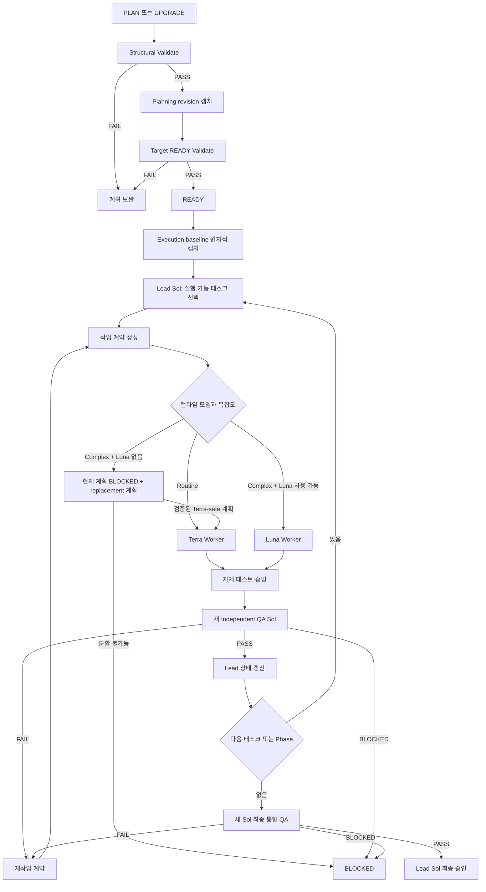

# Codex 실행 워크플로

최종 갱신: `2026-07-25 KST`

## 1. 기본 흐름



## 2. 공통 사전 검사

모든 모드에서 다음을 먼저 확인한다.

1. 사용자 요청과 대상 프로젝트 루트를 식별한다.
2. `README.md`, `AGENTS.md`, `CLAUDE.md`, 관련 `docs/*.md`, 최근 계획을 필요한
   범위에서만 읽는다.
3. 사용자 요청과 프로젝트 지침이 충돌하면 상위 지침을 따르고 충돌을 기록한다.
4. 모드와 허용 부작용을 확정한다.
5. 런타임이 현재 실행자를 Sol로 확인하지 못하면 `fork_turns: "none"`과 실제 Sol
   모델 식별자로 새 Lead를 생성하고 필요한 요구사항·파일 경로만 전달한다.
   `VALIDATE`와 `STATUS`의 읽기 전용 결정적 검사는 예외로 현재 실행자가 수행할 수
   있다.
6. 상태 변경 모드에서 Sol Lead를 생성할 수 없거나 필요한 파일·런타임 도구가 없으면
   임의 대체하지 않고 해당 모드의 실패
   형식으로 보고한다.
7. Worker/QA가 필요한 모드는 writable-root capability를 확인한다. 미지원이면
   `MANIFEST_GUARDED` 무결성 모델의 전체 보호 manifest·control-plane inventory·
   disposable workspace·integration lock을 준비한다. 이 보호 장치 중 하나라도
   준비할 수 없을 때만 `BLOCKED`다.

## 3. PLAN

1. 목표·범위·제외 범위·제약·완료 기준을 추출한다.
2. 구현을 막는 모호성만 사용자에게 확인하고, 안전한 기본값은 명시적으로 기록한다.
3. `new_dev_plan.py`로 새 `DRAFT` 계획을 생성한다.
4. 실제 프로젝트 구조를 확인해 예상 변경 경로와 검증 명령을 구체화한다.
5. `validate_dev_plan.py --level structural`을 실행한다.
6. Git revision 또는 비-Git manifest와 planning evidence를 외부 candidate로
   캡처한다.
7. 누락을 보완한 뒤 `PLAN_READY` payload를 만들어
   `--level executable --candidate-event EVENT.yaml --target-state READY`를 실행한다.
8. 준비 검증이 통과하면 Lead가 상태를 `READY`로 전환한다.
9. 제품 코드 수정과 Worker 생성은 하지 않는다.

## 4. UPGRADE

1. v1 계획 경로와 SHA-256을 기록한다.
2. 원본을 수정하지 않고 v2 신규 파일을 생성한다.
3. 목적·범위·Phase·태스크·테스트를 보존 가능한 범위에서 변환한다.
4. 추론할 수 없는 경로·의존성·완료 기준·검증 명령은 `TODO`로 남긴다.
5. structural 검증을 자동 실행한다.
6. `TODO`가 없으면 planning revision/evidence candidate를 캡처한다.
7. `PLAN_READY` payload와
   `--level executable --candidate-event EVENT.yaml --target-state READY`를 실행한다.
8. 성공하면 `PLAN_READY` 이벤트로 `READY`로 전환한다.
9. executable 검증 실패 또는 `TODO` 존재 시 `DRAFT`로 반환한다.
10. 제품 코드 수정과 Worker 생성은 하지 않는다.

## 5. VALIDATE

### 5.1 구조 검증

```text
validate_dev_plan.py PLAN.md --level structural
```

다음을 검사한다.

- frontmatter, 스키마 버전, 타임스탬프
- 필수 섹션과 엔터티 YAML block
- 허용 상태값과 체크박스 일치
- ID 고유성, 참조 무결성, 의존성 비순환성
- 현재 Phase와 Phase 상태의 일관성
- QA attempt와 report 참조 일관성

### 5.2 실행 가능성 검증

```text
validate_dev_plan.py PLAN.md --level executable
```

구조 검증 전체와 함께 다음을 검사한다.

- 계획 상태가 `READY`, `IN_PROGRESS`, `QA` 중 하나
- 플레이스홀더 없음
- planning/execution revision 또는 manifest 존재
- 각 태스크의 허용 경로·완료 기준·검증 절차
- Phase별 QA와 `QA-FINAL`
- 재작업 횟수와 증빙 참조

현재 상태를 바꾸기 전에 `--target-state READY|IN_PROGRESS|QA`와
`--candidate-event EVENT_PAYLOAD.yaml`을 추가하면 현재 문서와 아직 적용되지 않은
payload로 candidate 문서를 메모리에서 만들어 목표 상태 불변식을 검사한다.
`DRAFT → READY`, `READY → IN_PROGRESS`, `BLOCKED → blocked_from`은 반드시 이
방식을 사용한다. 검증기는 파일을 자동 변경하지 않는다.

### 5.3 출력 계약

```text
PLAN_VALID
level: executable
plan_id: PLAN-20260725-193455
```

실패:

```text
PLAN_NOT_EXECUTABLE

errors:
- code: MISSING_ALLOWED_PATHS
  entity: DEV-102
  message: 예상 변경 경로가 없습니다.
```

## 6. EXECUTE

### 6.1 Execution baseline 캡처

- planning revision/evidence를 현재 상태와 비교한다.
- 이미 존재하는 사용자 변경은 보존하며 Worker 결과와 분리한다.
- 현재 계획이 여전히 유효하면 현재 전체 보호 상태를 별도 execution baseline
  candidate로 캡처하고 `--candidate-event` 검증 후 `EXECUTION_STARTED` 이벤트에서
  `READY → IN_PROGRESS`와 함께 기록한다.
- 차이가 있으면 영향 범위를 다시 검증하고 candidate target IN_PROGRESS 검증을
  수행한다.
- 범위·경로·완료 기준에 영향을 주거나 기준 상태를 재구성할 수 없으면 `BLOCKED`다.

### 6.2 실행 가능 태스크 선택

Lead는 다음 조건을 모두 만족하는 태스크만 선택한다.

- 상태가 `PENDING` 또는 재배정 가능한 `REWORK`
- 모든 의존 태스크가 `DONE`
- 허용 경로가 현재 프로젝트에 유효
- 다른 실행 중 태스크와 경로 소유권이 겹치지 않음
- 검증 명령 또는 수동 검증 절차가 실행 가능

### 6.3 병렬 실행

다음 조건을 모두 만족할 때만 병렬 실행한다.

- 허용 경로 glob의 교집합이 없다.
- 태스크 간 직접·간접 의존성이 없다.
- 공통 설정, 스키마, lockfile 또는 생성 산출물을 함께 수정하지 않는다.
- 테스트가 다른 미완료 태스크에 의존하지 않는다.
- 사용자 변경 또는 다른 Worker의 미커밋 변경을 덮어쓰지 않는다.

하나라도 판정할 수 없으면 순차 실행한다.

병렬 Worker도 원본 worktree를 공유하지 않는다. 태스크별 disposable worktree 또는
snapshot을 만들고, 런타임의 동시 agent slot 안에서 wave로 실행한다. 가용 슬롯을
확정할 수 없거나 생성이 실패하면 병렬 성공으로 간주하지 않고 순차 실행한다.
병렬은 clean Git 대상만 허용한다. 같은 wave의 patch를 공통 input state 기반
integration worktree에 batch 적용해 aggregate patch와 output state를 만들고,
통합 테스트를 통과한 output state에서 다음 wave를 시작한다. dirty Git과 비-Git은
항상 순차 실행한다.

### 6.4 작업 계약과 Worker

Lead는 전체 계획의 자유 해석을 맡기지 않고 `docs/04-agent-roles-and-contracts.md`의
좁은 계약을 전달한다. Worker는 작업 시작 전 현재 파일 상태를 확인하고, 계약 밖
변경이 필요하면 수정하지 않은 채 `BLOCKED`로 보고한다.

Worker 완료 보고는 다음을 포함한다.

- 변경 파일
- 구현 요약
- 실제 실행한 테스트와 종료 코드
- 계획 이탈 여부
- 미해결 위험
- 결과 diff 또는 manifest

각 attempt에는 input state ID와 lease 만료 시각이 있다. Worker가 종료·유실되거나
lease가 만료되면 Lead는 attempt를 무효화하고 격리 공간의 상태를 검사한다. 원본에
통합된 변경이 없고 diff를 신뢰할 수 있으면 `REWORK`로 재배정하고, 변경 귀속을
확정할 수 없으면 태스크와 계획을 `BLOCKED`로 전환한다.

## 7. Independent QA

### 7.1 생성 규칙

- Phase의 태스크가 모두 `WORKER_DONE|DONE`이고 TEST가 모두 `PASS`면 새 Sol QA를
  생성한다.
- 런타임 위임 도구에 `fork_turns: "none"`과 실제 지원되는 Sol 식별자를 명시한다.
- 전체 이력 상속 또는 모델 fallback은 금지하며 요청한 조건으로 생성할 수 없으면
  `BLOCKED`다.
- 원본 요구사항, 계획, 계약, 실제 diff, 테스트 로그만 전달한다.
- Lead 예상 판정, Worker 자기평가, 이전 QA 결론은 전달하지 않는다.
- 재검증 때는 새 QA 에이전트와 새 attempt를 사용한다.
- 모델 enum snapshot, agent ID, 요청 모델, spawn 성공 결과, context mode를 QA
  attempt evidence에 기록한다. 런타임이 실제 모델을 명시적으로 반환할 때만
  `actual_model`을 추가하며, 그렇지 않으면 성공한 exact override를
  `assigned_model=requested_model`의 근거로 사용한다.

### 7.2 QA 무수정 보장

1. Worker 결과가 적용된 disposable QA worktree/snapshot을 생성한다.
2. QA 시작 직전 격리 공간과 실제 작업공간의 전체 보호 manifest를 캡처한다.
3. QA는 격리 공간에서 읽기·테스트만 수행하고 보고서를 최종 응답으로 반환한다.
4. Lead는 응답을 메모리에 보관한 채 QA 종료 직후 두 공간의 post-manifest와 기존
   contract·diff·log의 control-plane hash inventory를 먼저 캡처한다.
5. 실제 작업공간 변경 또는 허용되지 않은 격리 공간 변경이 있으면 attempt를
   `INVALID`로 보존하고 판정에 사용하지 않는다.
6. 무수정·무변조 검사가 통과하면 Lead가 응답 원문을 secret scan한다. secret이
   없을 때만 byte-for-byte로 append-only attempt sink의 `qa-response.txt`에
   저장하고 SHA-256을 기록한 뒤 `qa-report.yaml`과
   `evidence-manifest.yaml`을 검증·저장한다. secret이 발견되면 raw 응답을
   저장하지 않고 attempt를 무효화해 `BLOCKED` 처리한다.
7. 격리 공간은 원본 복구에 사용하지 않고 폐기한다. 실제 작업공간이 오염되고 사용자
   변경과 안전하게 분리할 수 없으면 `BLOCKED`다.

### 7.3 QA 판정

- `PASS`: 모든 기준 충족, 재현 가능한 중대 발견 없음
- `FAIL`: 수정 가능한 요구사항·회귀·범위 이탈 발견
- `BLOCKED`: 필수 자료·환경·권한 부족으로 판정 불가

QA는 파일·라인·테스트 명령·로그 등 재현 가능한 증빙을 보고해야 한다.

## 8. 재작업

1. QA `FAIL`을 수정 가능한 finding 단위로 변환한다.
2. 원 계획 범위 안이면 기존 DEV 태스크를 `REWORK`로 전환한다.
3. 범위 밖이면 현재 계획을 `BLOCKED`로 전환하고 새 계획을 제안한다.
4. 재작업 횟수를 증가시킨다.
5. `rework_count > max_rework`이면 자동 재시도를 중단하고 `BLOCKED` 처리한다.
6. 수정 완료 후 새로운 Independent QA Sol을 생성한다.
7. Lead는 Worker 역할을 대신해 직접 구현하지 않는다.

## 9. Phase와 최종 완료

Phase 완료 조건:

- 모든 DEV 태스크 `DONE`
- 모든 TEST `PASS`
- 해당 Independent QA `PASS`
- unresolved major/critical finding 없음
- Lead Phase 승인

Phase 승인 이벤트는 다음 `PENDING|REWORK_PENDING` Phase 하나를 `IN_PROGRESS`로
시작한다. 앞 Phase 변경으로 stale된 이후 Phase는 TEST와 QA를 순서대로 다시
검증한다.

모든 Phase 완료 후 계획을 `QA`로 전환하고 새 Sol로 `QA-FINAL`을 수행한다.

전체 완료 조건:

- `QA-FINAL` `PASS`
- QA 무수정 검증 PASS
- 잔여 위험 기록
- Lead 최종 승인
- 상태 갱신 스크립트의 structural 검증 PASS

## 10. RESUME

1. structural 검증 후 현재 또는 `blocked_from`을 목표로 executable 검증한다.
2. 현재 Git 상태 또는 manifest를 기존 baseline과 비교한다.
3. 완료 체크박스보다 실제 코드·증빙·QA 판정을 우선 대조한다.
4. 불일치는 자동 수정하지 않고 상태 reconciliation 보고서를 만든다.
5. 안전하게 확정 가능한 경우만 Lead가 계획 상태를 교정한다.
6. 의존성이 충족된 첫 미완료 태스크부터 재개한다.
7. 이미 `DONE`이고 증빙이 유효한 태스크는 재실행하지 않는다.

## 11. QA와 STATUS 전용 모드

`QA`:

- 지정 Phase 또는 `QA-FINAL` 입력 자료를 검증한다.
- 코드와 계획을 수정하지 않는다.
- 상태 변경이 필요하면 Lead가 QA 결과를 받은 뒤 별도로 적용한다.

`STATUS`:

- 계획 파일과 evidence를 읽어 현재 상태를 요약한다.
- 체크박스와 YAML 불일치, 누락 증빙, 차단 사유를 표시한다.
- 어떤 파일도 수정하지 않는다.

## 12. 실행 중단 조건

- 계획 범위 변경
- 사용자 결정 없이는 해소할 수 없는 요구사항 모호성
- 필요한 Worker 또는 Independent QA 모델 미제공
- 허용 경로가 실제 프로젝트 구조와 불일치
- 기준 상태 또는 안전한 diff 생성 불가
- 테스트 환경 구성 불가
- 재작업 한도 초과
- QA 독립성 또는 무수정 보장 실패
- 사용자 변경과 Worker 변경을 안전하게 분리할 수 없음
